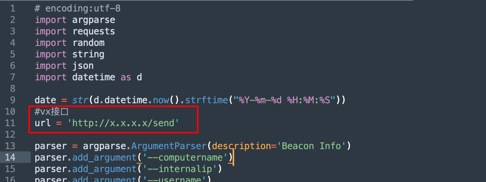
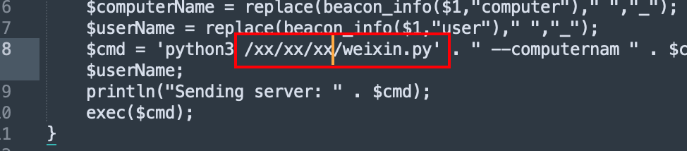
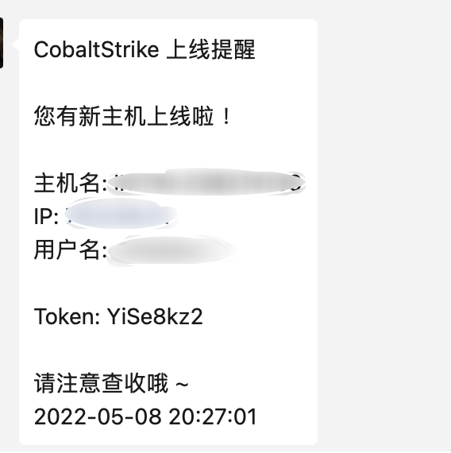
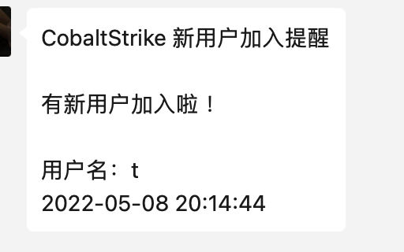

# CobaltStrike上线微信提醒

## cs-weixin

通过python脚本和CobaltStrike插件配合达到微信推送提醒的效果。

## 配置

> **脚本需要更改的两个地方**

### weixin.py

**wx接口需要替换为自己的机器人接口**



### weixin.cna

**在客户端或者服务端后台挂载时，需要改成 `weixin.py` Python 脚本所在的绝对路径**



## 服务端后台挂载

**把 cna 脚本添加到本地客户端后，如果beacon上线了，这个提醒的请求是从客户端发出的。**

**如果网络有波动，断开了到 teamserver 的连接，就收不到通知了。**

**解决方法是使用 agscript 在服务器端运行cna文件，和挂载 CobaltStrike 一样，把 cna 脚本也挂载到后台：**

```shell
screen -S cs-weixin
chmod +x agscript
./agscript xx.xxx.xx.xxx [port] [user] [passwd] weixin.cna
```

## Agscript 用法

```
 ./agscript [host] [port] [user] [pass] </path/to/file.cna>
```

- **[host] # 服务器的 ip 地址。**
- **[port] # cs 的端口号，启动 cs 时有显示。**
- **[user] # 后台挂载脚本时连接到 teamserver 的用户名。**
- **[pass] # 启动服务端 cs 时设置的密码。**
- **[path] # cna 文件的路径。**

## 效果展示






## From

https://github.com/kingz40o/Aggressor_dingding

https://github.com/lintstar/CS-PushPlus
